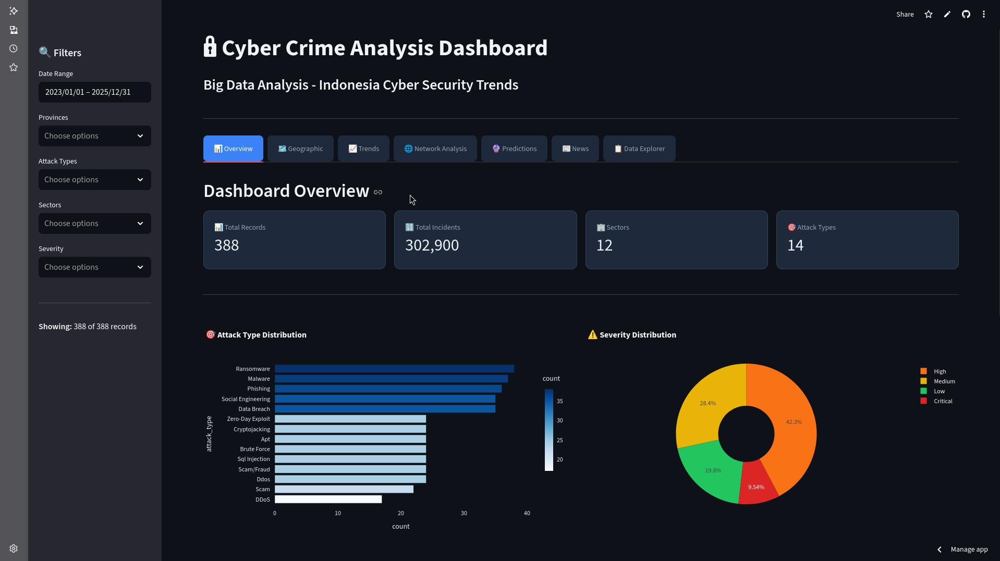
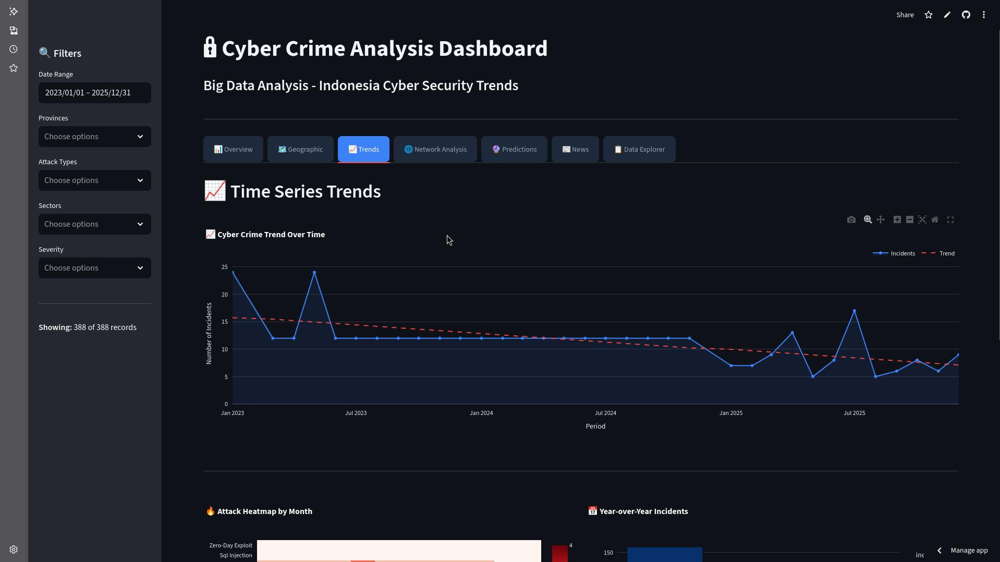
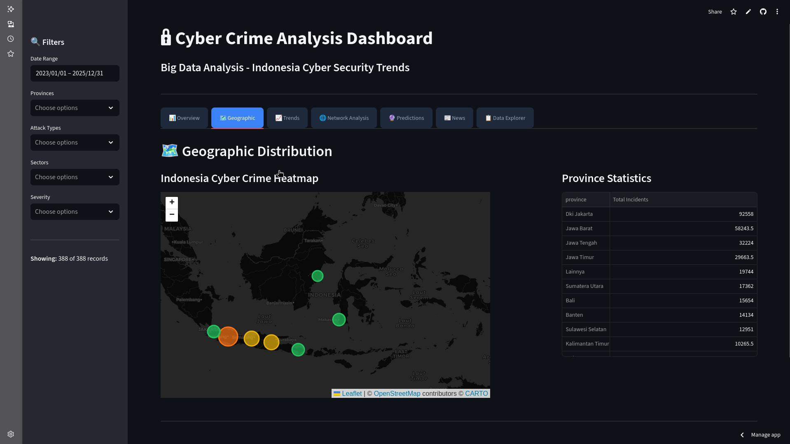
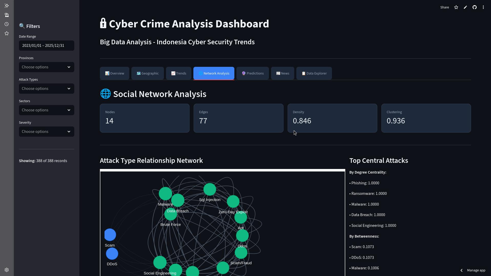
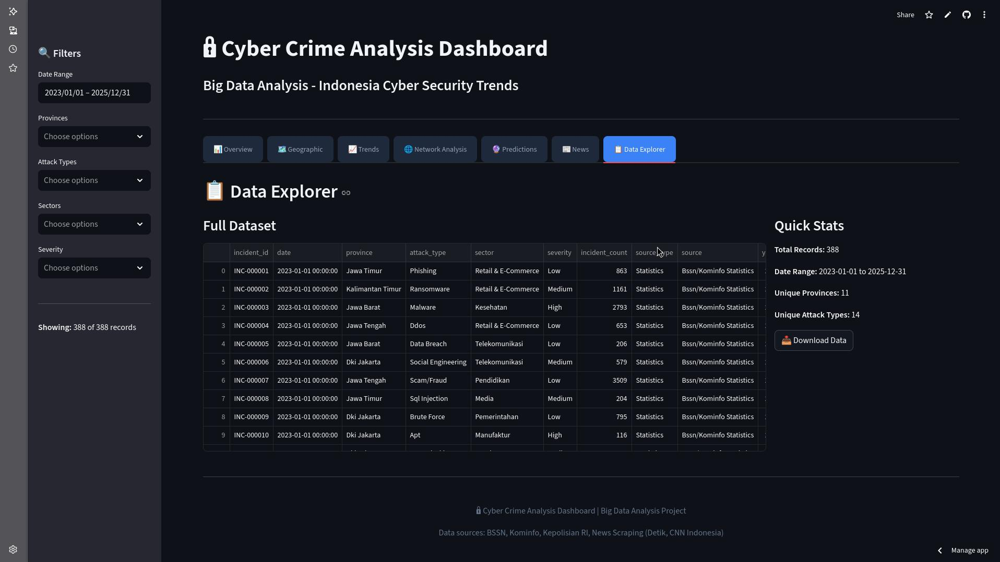

# Analisis Big Data: Kejahatan Siber di Indonesia
Proyek ini memadukan pipeline data, analisis jaringan sosial, prediksi tren, dan dashboard interaktif Streamlit untuk memetakan pola kejahatan siber di Indonesia secara komprehensif.

## Sorotan Utama
- Integrasi data pemerintah (CSV) dan hasil scraping berita, lengkap dengan pembersihan nilai hilang/duplikat.
- Social Network Analysis untuk memetakan relasi serangan dan metrik centrality.
- Prediksi time series (forecast 6 bulan) untuk mendeteksi tren eskalasi.
- Dashboard Streamlit modern dengan filter dinamis, peta Indonesia, heatmap, dan eksplorasi data.

## Arsitektur Singkat
- `src/data_collection`: pengumpulan data pemerintah dan berita.
- `src/data_cleaning`: pembersihan, standarisasi, dan penanganan outlier.
- `src/sna`: analisis jaringan (relationship, centrality, visual).
- `src/ml`: pipeline prediksi time series.
- `dashboard`: aplikasi Streamlit utama (komponen visual, filter, layout).
- `data/raw|processed|external`: sumber, hasil pembersihan, dan data eksternal terintegrasi.

## Persiapan Lingkungan
```bash
python -m venv venv
source venv/bin/activate  # Windows: venv\Scripts\activate
pip install --upgrade pip
pip install -r requirements.txt
```

## Menjalankan Dashboard Lokal
```bash
streamlit run dashboard/app.py
```
Dashboard akan terbuka di `http://localhost:8501`. Pastikan data contoh tersedia di `data/raw/sample_government_data.csv` atau jalankan modul koleksi data terlebih dahulu.

## Opsi Deployment Cepat
1) **Streamlit Community Cloud (paling praktis)**  
   - Push repo ke GitHub (wajib ada `dashboard/app.py` dan `requirements.txt`).  
   - Buka https://share.streamlit.io, pilih repo/branch/file, set versi Python bila perlu, lalu deploy.  
   - Tambahkan kredensial lewat UI Secrets; akses di kode via `st.secrets["KEY"]`.

2) **Docker (cocok untuk VPS/Render/Fly/Heroku)**  
   `Dockerfile` contoh:
   ```Dockerfile
   FROM python:3.11-slim
   WORKDIR /app
   COPY requirements.txt .
   RUN pip install --no-cache-dir -r requirements.txt
   COPY . .
   EXPOSE 8501
   CMD ["streamlit", "run", "dashboard/app.py", "--server.port=8501", "--server.address=0.0.0.0"]
   ```
   Build & run:
   ```bash
   docker build -t cybercrime-streamlit .
   docker run -p 8501:8501 cybercrime-streamlit
   ```

3) **Tanpa Docker di PaaS**  
   Jalankan `pip install -r requirements.txt`, lalu start dengan:  
   ```bash
   streamlit run dashboard/app.py --server.port=$PORT --server.address=0.0.0.0
   ```

## Struktur Proyek
```
dashboard/           # Aplikasi Streamlit (app.py, components.py)
data/                # raw | processed | external
src/                 # data_collection, data_cleaning, sna, ml, utils
integrate_real_data.py
requirements.txt
doc/                 # aset gambar dokumentasi dashboard
```

## Dokumentasi Visual (doc/)






## Catatan Pengembangan
- Gunakan `st.cache_data`/`st.cache_resource` untuk mempercepat load di produksi.
- Versi dependency sebaiknya dipatok (pin) untuk menghindari build yang tidak stabil.
- Simpan rahasia di `.streamlit/secrets.toml` (jangan di-commit).
